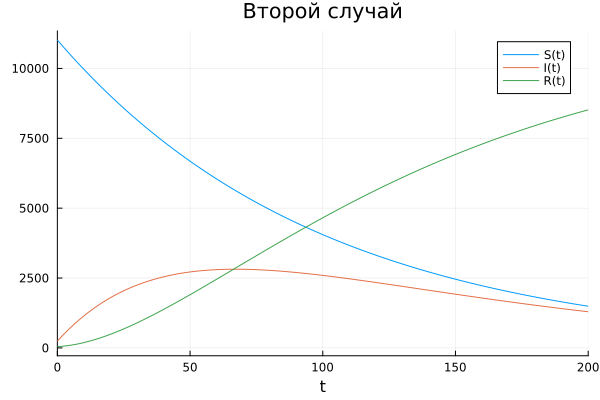

---
# Front matter
lang: ru-RU
title: "Отчет по Лабораторной Работе №6"
subtitle: "Модель эпидемии- Вариант 27"
author: "Озьяс Стев Икнэль Дани"

# Formatting
toc-title: "Содержание"
toc: true # Table of contents
toc_depth: 2
lof: true # List of figures
fontsize: 12pt
linestretch: 1.5
papersize: a4paper
documentclass: scrreprt
polyglossia-lang: russian
polyglossia-otherlangs: english
mainfont: PT Serif
romanfont: PT Serif
sansfont: PT Sans
monofont: PT Mono
mainfontoptions: Ligatures=TeX
romanfontoptions: Ligatures=TeX
sansfontoptions: Ligatures=TeX,Scale=MatchLowercase
monofontoptions: Scale=MatchLowercase
indent: true
pdf-engine: lualatex
header-includes:
  - \linepenalty=10 # the penalty added to the badness of each line within a paragraph (no associated penalty node) Increasing the υalue makes tex try to haυe fewer lines in the paragraph.
  - \interlinepenalty=0 # υalue of the penalty (node) added after each line of a paragraph.
  - \hyphenpenalty=50 # the penalty for line breaking at an automatically inserted hyphen
  - \exhyphenpenalty=50 # the penalty for line breaking at an explicit hyphen
  - \binoppenalty=700 # the penalty for breaking a line at a binary operator
  - \relpenalty=500 # the penalty for breaking a line at a relation
  - \clubpenalty=150 # extra penalty for breaking after first line of a paragraph
  - \widowpenalty=150 # extra penalty for breaking before last line of a paragraph
  - \displaywidowpenalty=50 # extra penalty for breaking before last line before a display math
  - \brokenpenalty=100 # extra penalty for page breaking after a hyphenated line
  - \predisplaypenalty=10000 # penalty for breaking before a display
  - \postdisplaypenalty=0 # penalty for breaking after a display
  - \floatingpenalty = 20000 # penalty for splitting an insertion (can only be split footnote in standard LaTeX)
  - \raggedbottom # or \flushbottom
  - \usepackage{float} # keep figures where there are in the text
  - \floatplacement{figure}{H} # keep figures where there are in the text
---

# Цель работы

Рассмотрим простейшую модель эпидемии. Предположим, что некая популяция, состоящая из N особей, (считаем, что популяция изолирована) подразделяется на три группы. Первая группа - это восприимчивые к болезни, но пока здоровые особи, обозначим их через $S(t)$. Вторая группа – это число инфицированных особей, которые также при этом являются распространителями инфекции, обозначим их $I(t)$. А третья группа, обозначающаяся через $R(t)$ – это здоровые особи с иммунитетом к болезни. 


# Задание

Постройте графики изменения числа особей в каждой из трех групп.
Рассмотрите, как будет протекать эпидемия в случае:
1. если $I(0) \leq I^{\ast} $
2. если  $I(0) > I^{\ast} $

# Выполнение лабораторной работы

## Теоретические сведения

До того, как число заболевших не превышает критического значения $I^{\ast}$, считаем, что все больные изолированы и не заражают здоровых. Когда $I(t) > I^{\ast}, тогда инфицирование способны заражать восприимчивых к болезни особей. Таким образом, скорость изменения числа $S(t)$ меняется по следующему закону:

$$
\frac{dS}{dt}= \begin{cases} -aS, & \text{если }  I(t) > I^{\ast}\\\\ 0, & \text{если } I(t) \leq I^{\ast}\end{cases}
$$


Поскольку каждая восприимчивая к болезни особь, которая, в конце концов, заболевает, сама становится инфекционной, то скорость изменения числа инфекционных особей представляет разность за единицу времени между заразившимися и теми, кто уже болеет и лечится, т.е.:

$$
\frac{dI}{dt} = \begin{cases} aS- bI, & \text{если }  I(t) > I^{\ast}\\\\ -bI, & \text{если } I(t) \leq I^{\ast} \end{cases}
$$

А скорость изменения выздоравливающих особей (при этом приобретающие иммунитет к болезни)

$$
\begin{equation}
\frac{dR}{dt} = bI
\end{equation}
$$

:memo: **Note:** Постоянные пропорциональности $a$, $b$ , - это коэффициенты заболеваемости и выздоровления соответственно.


## Задача

На одном острове вспыхнула эпидемия. Известно, что из всех проживающих на острове $N=11 300$ в момент начала эпидемии $t=0$ число заболевших людей (являющихся распространителями инфекции) $I(0)=240$, А число здоровых людей с иммунитетом к болезни $R(0)=46$. Таким образом, число людей восприимчивых к болезни, но пока здоровых, в начальный момент времени $S(0)=N-I(0)- R(0)$.


Постройте графики изменения числа особей в каждой из трех групп.
Рассмотрите, как будет протекать эпидемия в случае:
1. если $I(0) \leq I^{\ast} $


<p align="center">
  *Динамика изменения числа людей 1*
</p>

2. если  $I(0) > I^{\ast} $


<p align="center">
  *Динамика изменения числа людей 2*
</p>

## Код программы (Julia)

```
using Plots
using DifferentialEquations

a = 0.01; # коэффициент заболеваемости
b = 0.02; # коэффициент выздоровления
N = 11300; # общая численность популяции
I0 = 240; # количество инфицированных особей в начальный момент времени
R0 = 46; # количество здоровых особей с иммунитетом в начальныймомент времени
S0 = N - I0 - R0; # количество восприимчивых к болезни особей в начальный момент времени

x0 = [S0;I0;R0]; #начальные значения
t = (0,200);

#ПЕРВЫЙ СЛУЧАЙ


# случай, когда I(0)<=I*
function F1(du, u, p, t)
    du[1] = 0;
    du[2] = - b*u[2];
    du[3] = b*u[2];
end

prob = ODEProblem(F1, x0, t)
sol = solve(prob)

plot(sol, label=["S(t)" "I(t)" "R(t)"], title="Первый случай")
savefig("image1.png")


#ВТОРОЙ СЛУЧАЙ
# случай, когда I(0)>I*
function F2(du, u, p, t)
    du[1] = - a*u[1] ;
    du[2] = a*u[1] - b*u[2];
    du[3] = b*u[2];
end

prob = ODEProblem(F2, x0, t)
sol = solve(prob)

plot(sol, label=["S(t)" "I(t)" "R(t)"], title="Второй случай")
savefig("image2.png")

```

# Выводы

В результате проделанной лабораторной работы мы познакомились с моделем эпидемии. 
Проверили, как работает модель в различных ситуациях, показали динамику изменения числа людей в каждой из трех групп в каждом случае.

# Список литературы

1. [Модель эпидемии](https://hal.science/hal-02509142v4/file/epidemie_ru.pdf)
