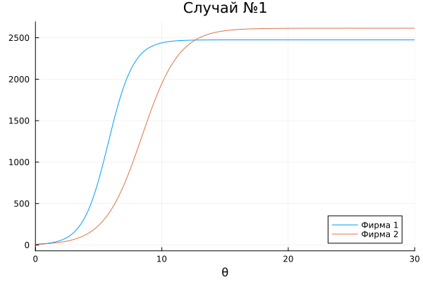
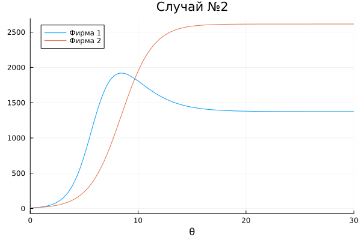

---
# Front matter
lang: ru-RU
title: "Отчет по Лабораторной Работе №8"
subtitle: "Модель конкуренции двух фирм - Вариант 27"
author: "Озьяс Стев Икнэль Дани"

## Pdf output format
toc: true # Table of contents
toc-depth: 2
fontsize: 12pt
linestretch: 1.5
papersize: a4
documentclass: scrreprt
## I18n polyglossia
polyglossia-lang:
  name: russian
  options:
        - spelling=modern
        - babelshorthands=true
polyglossia-otherlangs:
  name: english
## I18n babel
babel-lang: russian
babel-otherlangs: english
## Fonts
mainfont: PT Serif
romanfont: PT Serif
sansfont: PT Sans
monofont: PT Mono
mainfontoptions: Ligatures=TeX
romanfontoptions: Ligatures=TeX
sansfontoptions: Ligatures=TeX,Scale=MatchLowercase
monofontoptions: Scale=MatchLowercase,Scale=0.9
## Biblatex
biblatex: true
biblio-style: "gost-numeric"
biblatexoptions:
  - parentracker=true
  - backend=biber
  - hyperref=auto
  - language=auto
  - autolang=other*
  - citestyle=gost-numeric
## Pandoc-crossref LaTeX customization
figureTitle: "Рис."
tableTitle: "Таблица"
listingTitle: "Листинг"
lofTitle: "Цель Работы"
lotTitle: "Ход Работы"
lolTitle: "Листинги"
## Misc options
indent: true
header-includes:
  - \usepackage{indentfirst}
  - \usepackage{float} # keep figures where there are in the text
  - \floatplacement{figure}{H} # keep figures where there are in the text
---

# Цель работы

Будем рассматривать модель конкуренции для двух фирм, производящих взаимозаменяемые товары одинакового качества и находящиеся в одной рыночной нише.

# Задание

1. Придумайте свой пример двух конкурирующих фирм с идентичным товаром. Задайте начальные значения и известные составляющие. Постройте графики изменения объемов оборотных средств каждой фирмы. Рассмотрите два случая.
2. Проанализируйте полученные результаты.
3. Найдите стационарное состояние системы для первого случая.


# Выполнение лабораторной работы

## Теоретические сведения

**1. Модель одной фирмы**

Для построения модели конкуренции хотя бы двух фирм необходимо рассмотреть модель одной фирмы. Вначале рассмотрим модель фирмы, производящей продукт долговременного пользования, когда цена его определяется балансом спроса и предложения. Примем, что этот продукт занимает определенную нишу рынка и конкуренты в ней отсутствуют.

Обозначим:
- N – число потребителей производимого продукта.
- S – доходы потребителей данного продукта. Считаем, что доходы всех потребителей одинаковы. Это предположение справедливо, если речь идет об одной рыночной нише, т.е. производимый продукт ориентирован на определенный слой населения.
- M – оборотные средства предприятия
- τ – длительность производственного цикла
- p – рыночная цена товара
- p̃ – себестоимость продукта, то есть переменные издержки на производство единицы продукции.
- δ – доля оборотных средств, идущая на покрытие переменных издержек.
- κ – постоянные издержки, которые не зависят от количества выпускаемой продукции.

Уравнения динамики оборотных средств можно записать в виде:

$\frac{dM}{dt} = - \frac{M δ}{\tau} + NQp - \kappa$


**2. Модель двух фирм**

Рассмотрим две фирмы, производящие взаимозаменяемые товары одинакового качества и находящиеся в одной рыночной нише. Последнее означает, что у потребителей в этой нише нет априорных предпочтений, и они приобретут тот или иной товар, не обращая внимания на знак фирмы. В этом случае, на рынке устанавливается единая цена, которая определяется балансом суммарного предложения и спроса. Иными словами, в рамках нашей модели конкурентная борьба ведётся только рыночными методами. То есть, конкуренты могут влиять на противника путем изменения параметров своего производства: себестоимость, время цикла, но не могут прямо вмешиваться в ситуацию на рынке («назначать» цену или влиять на потребителей какимлибо иным способом.)

Систему уравнений динамики оборотных средств можно записать в виде:

$$
\begin{cases}
	\frac{dM_1}{dt} = c_1 M_1 - b M_1 M_2 - a_1 M_1^2 - \kappa_1 \\
	\frac{dM_2}{dt} = c_2 M_1 - b M_1 M_2 - a_2 M_1^2 - \kappa_2
\end{cases}
$$

Где:
$a_1 = \frac{P_{cr}}{t_1^2 p̃_1^2 Nq}$, 
$a_2 = \frac{P_{cr}}{t_2^2 p̃_2^2 Nq}$, 
$b = \frac{P_{cr}}{t_1^2 t_2^2 p̃_1^2 p̃_2^2 Nq}$, 
$c_1 = \frac{P_{cr} - p̃_1}{t_1 p̃_1}$, 
$c_2 = \frac{P_{cr} - p̃_2}{t_2 p̃_2}$


## Теоретический материал

Поскольку постоянные издержки $(\kappa_1, \kappa_2)$ пренебрежимо малы и $t = c_1 \theta$, задача сводится к решению данной системы уравнений

$$
\begin{cases}
	\frac{dM_1}{d\theta} = M_1 - \frac{b}{c_1} M_1 M_2 - \frac{a_1}{c_1} M_1^2\\
	\frac{dM_2}{d\theta} = \frac{c_2}{c_1} M_1 - \frac{b}{c_1} M_1 M_2 - \frac{a_2}{c_1} M_1^2
\end{cases}
$$


## Задача

- **Случай 1**

Рассмотрим две фирмы, производящие взаимозаменяемые товары одинакового качества и находящиеся в одной рыночной нише. Считаем, что в рамках нашей модели конкурентная борьба ведётся только рыночными методами. То есть, конкуренты могут влиять на противника путем изменения параметров своего производства: себестоимость, время цикла, но не могут прямо вмешиваться в ситуацию на рынке («назначать» цену или влиять на потребителей каким-либо иным способом.) Будем считать, что постоянные издержки пренебрежимо малы, и в модели учитывать не будем. В этом случае динамика изменения объемов продаж фирмы 1 и фирмы 2 описывается следующей системой уравнений:


$$
\begin{cases}
	\frac{dM_1}{d\theta} = M_1 - \frac{b}{c_1} M_1 M_2 - \frac{a_1}{c_1} M_1^2\\
	\frac{dM_2}{d\theta} = \frac{c_2}{c_1} M_1 - \frac{b}{c_1} M_1 M_2 - \frac{a_2}{c_1} M_1^2
\end{cases}
$$

{ #fig:001 width=70% }

- **Случай 2**

Рассмотрим модель, когда, помимо экономического фактора влияния (изменение себестоимости, производственного цикла, использование кредита и т.п.), используются еще и социально-психологические факторы – формирование общественного предпочтения одного товара другому, не зависимо от их качества и цены. В этом случае взаимодействие двух фирм будет зависеть друг от друга, соответственно коэффициент перед $M_1 M_2$ будет отличаться. Пусть в рамках рассматриваемой модели динамика изменения объемов продаж фирмы 1 и фирмы 2 описывается следующей системой уравнений

$$
\begin{cases}
	\frac{dM_1}{d\theta} = M_1 - \frac{b + 0.00017}{c_1} M_1 M_2 - \frac{a_1}{c1} M_1^2\\
	\frac{dM_2}{d\theta} = \frac{c_2}{c_1} M_1 - \frac{b}{c_1} M_1 M_2 - \frac{a_2}{c1} M_1^2
\end{cases}
$$


{ #fig:002 width=70% }


## Код программы (Julia)

```
using Plots
using DifferentialEquations

#СЛУЧАЙ №1

p_cr = 39; #критическая стоимость продукта
tau1 = 31; #длительность производственного цикла фирмы 1
p1 = 11.2; #себестоимость продукта у фирмы 1
tau2 = 28; #длительность производственного цикла фирмы 2
p2 = 15.5; #себестоимость продукта у фирмы 2
N = 10; #число потребителей производимого продукта
q = 1; #максимальная потребность одного человека в продукте вединицу времени

a1 = p_cr/(tau1*tau1*p1*p1*N*q);
a2 = p_cr/(tau2*tau2*p2*p2*N*q);
b = p_cr/(tau1*tau1*tau2*tau2*p1*p1*p2*p2*N*q);
c1 = (p_cr-p1)/(tau1*p1);
c2 = (p_cr-p2)/(tau2*p2);

function F(du, u, p, t)
    du[1] = u[1] - (a1/c1)*u[1]*u[1] - (b/c1)*u[1]*u[2];
    du[2] = (c2/c1)*u[2] - (a2/c1)*u[2]*u[2] - (b/c1)*u[1]*u[2];
end

M1_0 = 7.7
M2_0 = 8.8
t = (0,30);
M0 = [M1_0, M2_0]; #вектор начальных значений объема оборотных средств M1 и M2

prob = ODEProblem(F, M0, t)

sol = solve(prob)

plot(sol, label= ["Фирма 1" "Фирма 2"], xlabel = "θ", title="Случай №1")

savefig("image1.png")

#СЛУЧАЙ №2

function F(du, u, p, t)
    du[1] = u[1] - (a1/c1)*u[1]*u[1] - (b/c1 + 0.00017)*u[1]*u[2];
    du[2] = (c2/c1)*u[2] - (a2/c1)*u[2]*u[2] - (b/c1)*u[1]*u[2];
end

M1_0 = 7.7
M2_0 = 8.8
t = (0,30);
M0 = [M1_0, M2_0]; #вектор начальных значений объема оборотных средств M1 и M2

prob = ODEProblem(F, M0, t)

sol = solve(prob)

plot(sol, label= ["Фирма 1" "Фирма 2"], xlabel = "θ", title="Случай №2")
savefig("image2.png")
```

# Выводы

В результате проделанной лабораторной работы мы познакомились с моделем двух фирм. Проверили, как работает модель в различных ситуациях, построили графики изменения оборотных средств при данных условиях.

# Список литературы{.unnumbered}

::: {#refs}
:::

1. [Модель конкуренции двух фирм](https://natural-sciences.ru/ru/article/view?id=14730)
